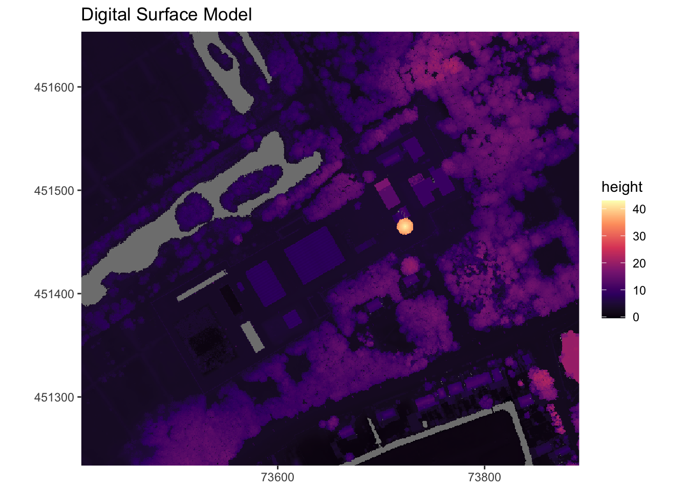
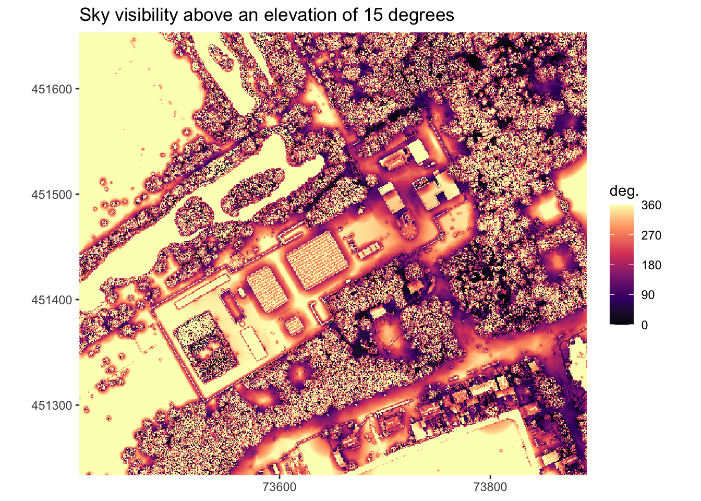

# sky-visibility

Sometimes you just find yourself in a situation where you have to calculate how much clear sky you can see above a certain elevation (an angle above the horizon), for example if you have to place a radar somewhere which needs a clear line-of-sight above 30 degrees. Many of the GIS tools that you can use require pre-selecting certain ‘viewpoints’ from which to calculate it, or they assume you’re standing on the ground.

Anyhow, this calculates the proportion and the number of degrees of clear line-of-sight or ‘sky visibility’ above a certain threshold elevation (angle in degrees above to the horizon) across a digital elevation model. And it works with digital surface models too, so you can also check what the sky visibility is on e.g. rooftops or next to buildings.

Let’s use an example for clarification.

## The digital surface model (DSM):

## Sky Visibility map
The map below shows, based on the DSM, the number of degrees of clear line-of-sight ‘sky visibility’ above 15 degrees you have in the mapped area. 

Alternatively, you can also think of it from the perspective of an imaginary moving sun. If the sun would rotate 360 degrees around us and never go down, but it would always be 15 degrees above the horizon, this shows the number of degrees (0-360 degrees) you can see the sun from at each location.

It makes intuitive sense that with a sun that low above the horizon, the only areas you can really see the sun from most of the time are the flat areas on the left side of the map with no obstructions nearby. Similarly, close to obstructions, or in an open area in between trees, it is much rarer to have clear line-of-sight of the sun — you want to go as far as possible from obstructions to see the sun. Deep in the forest, you never see the sun directly (assuming light cannot shine through trees).

